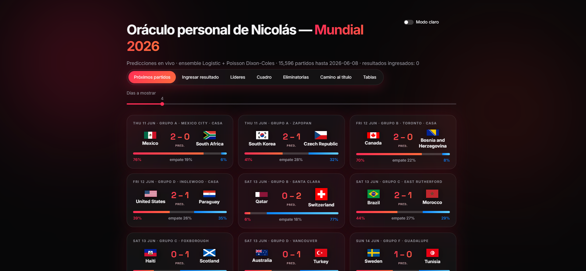
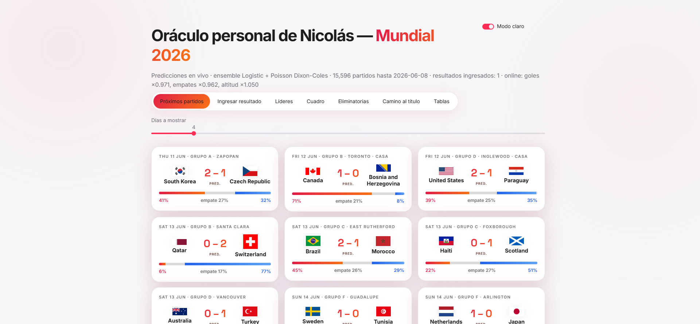
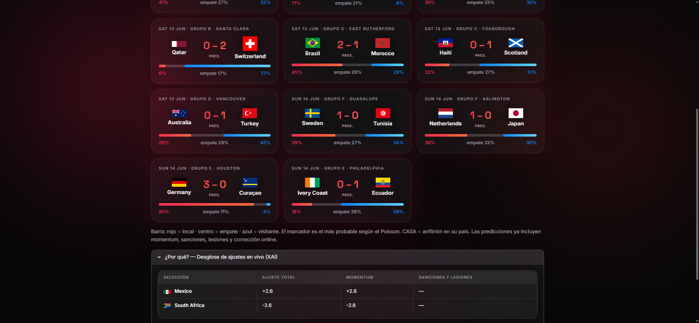

# Mundial 2026 — Predicción y Clasificación (ML)

Proyecto académico de Machine Learning sobre un **data lake local** de fútbol de
selecciones (2010–2026). Objetivo: aprender **regresión** y **clasificación** de
forma rigurosa, con dos modelos:

- **Clasificación** — resultado `1·X·2` (gana local / empate / gana visitante).
- **Regresión** — goles por equipo con modelo **Poisson (Dixon-Coles)**; de la
  distribución de goles se derivan las probabilidades de resultado.

Arquitectura *medallion* (`bronze → silver → gold`) en local, diseñada para
migrar a AWS (S3 + Athena) sin reescribir la lógica. Plan completo en
[`docs/PLAN.md`](docs/PLAN.md).

## Estructura

```
mundial-2026-ml/
├── config/settings.yaml      # rutas, rango temporal, fuentes, split de validación
├── data/
│   ├── raw/                  # bronze: descargas tal cual (no se versiona)
│   ├── interim/              # silver: limpio y tipado
│   └── processed/            # gold: features ML (una fila = un partido)
├── src/mundial/
│   ├── config.py             # carga settings + rutas del proyecto
│   ├── ingest/               # descarga de fuentes -> raw
│   ├── features/             # feature engineering (con tests anti-leakage)
│   ├── models/               # classification.py + poisson.py
│   └── evaluate/             # baselines, métricas, calibración
├── scripts/                  # orquestadores ejecutables por sprint
├── sql/                      # queries (hoy pandas; mañana Athena)
├── notebooks/                # EDA
├── tests/
└── docs/PLAN.md              # plan robusto y escalonado
```

## Setup (Windows · Git Bash)

```bash
python -m venv .venv
source .venv/Scripts/activate
pip install -r requirements.txt
```

## Uso

```bash
# 1. Descargar/actualizar datos (gratis, sin API key; martj42 se actualiza a diario)
python scripts/00_download_tier0.py

# 2. Reconstruir silver y gold
python scripts/01_build_silver.py
python scripts/02_build_features.py

# 3. (opcional) comparar baselines con validación temporal
python scripts/03_train_baseline.py

# 4. Entrenar el modelo FINAL (ensemble Logistic + Poisson Dixon-Coles)
#    -> guarda models/artifacts.joblib
python scripts/04_train_final.py

# 5. UI de predicciones en vivo del Mundial
streamlit run app.py
```

### UI en vivo (`app.py`)

Durante el Mundial: ingresa cada resultado en la pestaña **Ingresar resultado**;
el motor actualiza Elo/forma/H2H y recalcula las predicciones de los próximos
partidos. Incluye predictor de cruces de eliminatoria (con P(avanza) vía
prórroga/penales aproximados por Elo), tablas de grupos y ranking Elo.
Los resultados ingresados se guardan en `data/live/live_results.csv`.

### Rendimiento honesto (validación temporal, test 2022 →)

| Modelo | Accuracy | Log-loss |
|---|---|---|
| Siempre gana local | 0.477 | 1.051 |
| Solo Elo | 0.598 | 0.874 |
| Ensemble (Logistic 0.8 + Poisson DC 0.2) | **0.602** | **0.867** |

Calibración casi perfecta (cuando predice 80% acierta ~80%). En torneos
grandes (Mundial/Euro/Copa América 2022+) el acierto baja a ~53% — ese es el
techo real del estado del arte; desconfía de cualquier modelo que prometa más.

## Fuentes de datos (todas gratuitas)

| Dataset | Fuente | Cobertura | Uso |
|---|---|---|---|
| Resultados internacionales | [martj42/international_results](https://github.com/martj42/international_results) | 1872–2026, **incl. todas las eliminatorias** | resultados, goles, H2H, forma |
| Mundial 2026 | [openfootball/worldcup.json](https://github.com/openfootball/worldcup.json) | equipos, estadios, calendario 2026 | sedes (altitud), fixtures a predecir |
| Elo selecciones | calculado desde resultados (Sprint 2) | 2010–2026 | rating de fuerza |
| Event data élite | [StatsBomb open-data](https://github.com/statsbomb/open-data) | Mundiales 2018 + 2022 | xG, presión, pases (dataset *profundo*) |

## Roadmap

Seis sprints con entregable funcional en cada uno. Detalle en [`docs/PLAN.md`](docs/PLAN.md).

## Capa live (Mundial en curso) — 2026-06

- **Ingesta extendida**: marcador, xG, goleadores/asistencias, tarjetas, lesiones, clima y formación (`data/live/`, gestionado por `mundial.live.store.LiveStore`).
- **Feature State Updating**: momentum (K=45 con xG), suspensiones FIFA y lesiones como ajustes Elo solo en predicción.
- **Online Learning** con shrinkage bayesiano: ritmo de goles, empates y altitud — sin reentrenar (factores=1.0 con 0 partidos).
- **UI**: temas dark (negro+rojo, aurora animada) / light, tabs Líderes y Cuadro (bracket Monte Carlo con H2H FIFA), XAI con desglose de cada modificador.
- **Spec y tests**: contratos en [`docs/ARCHITECTURE_SPEC.md`](docs/ARCHITECTURE_SPEC.md); `pytest` (19 tests: sanciones, consolidación, desempate H2H).

| Dark | Light | XAI |
|---|---|---|
|  |  |  |
